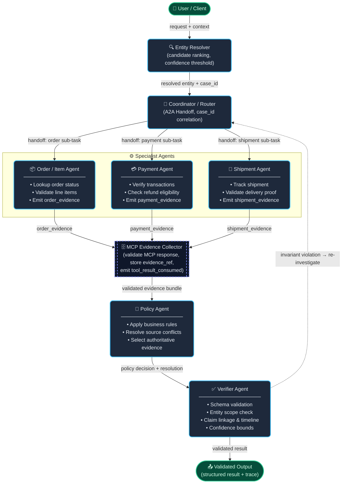

# L3B Architecture Record

Team phải cập nhật tài liệu này cùng source. Mục tiêu là mô tả quyết định có thể kiểm chứng, không ghi prompt bí mật hoặc chain-of-thought.

## 1. System Overview

Kiến trúc phối hợp đa tác tử (A2A) — luồng từ User Request qua Coordinator/Router, phân phối tới các Specialist Agent, thu thập Evidence qua MCP, tổng hợp tại Policy Agent, kiểm chứng tại Verifier và xuất kết quả cuối cùng.

```

```

### Luồng dữ liệu chính

| Bước | Từ | Đến | Payload |
|-----:|-----|------|---------|
| 1 | User | Entity Resolver | Raw request + context |
| 2 | Entity Resolver | Coordinator | Resolved entity, `case_id`, confidence score |
| 3 | Coordinator | Specialists (×3) | Sub-task envelope (A2A Handoff) |
| 4 | Specialists | MCP Evidence Collector | Typed evidence (`order_evidence`, `payment_evidence`, `shipment_evidence`) |
| 5 | MCP | Policy Agent | Validated evidence bundle + `evidence_ref` |
| 6 | Policy Agent | Verifier | Policy decision, resolved conflicts, authoritative source |
| 7 | Verifier | Output | Final structured result + full trace |
| 7↩ | Verifier | Coordinator | Re-investigate signal (nếu invariant vi phạm) |

## 2. Agent ownership

| Actor | Input | Trách nhiệm | Tool permission | Output/handoff |
| --- | --- | --- | --- | --- |
| Entity/customer | TODO | TODO | TODO | TODO |
| Coordinator | TODO | TODO | TODO | TODO |
| Order/product | TODO | TODO | TODO | TODO |
| Shipment | TODO | TODO | TODO | TODO |
| Payment/refund | TODO | TODO | TODO | TODO |
| Policy | TODO | TODO | TODO | TODO |
| Conflict resolver | TODO | TODO | TODO | TODO |
| Verifier | TODO | TODO | TODO | TODO |

Áp dụng least privilege; tool discovery không đồng nghĩa mọi actor đều được gọi mọi tool.

## 3. Entity resolution và A2A protocol

Mô tả cách xếp hạng/reject candidate, confidence threshold, message envelope, correlation theo `case_id`, điều kiện handoff, timeout và cách tránh vòng lặp. Không trace nội dung suy luận riêng.

## 4. Evidence và conflict lifecycle

Mô tả cách validate MCP response, lưu `evidence_ref`, chọn source theo policy, biểu diễn unresolved conflict, map evidence vào claim/output và emit `tool_result_consumed`. Evidence không được tái sử dụng giữa các case.

## 5. Failure and efficiency policy

| Failure | Retry budget | Fallback | Trace event/code |
| --- | ---: | --- | --- |
| MCP timeout | TODO | TODO | TODO |
| Entity not found/ambiguous | TODO | TODO | TODO |
| Source conflict | TODO | TODO | TODO |
| Invalid specialist result | TODO | TODO | TODO |

Nêu query budget/cache strategy để tránh gọi lặp và quét rộng. Retry phải có giới hạn, idempotent và không biến missing evidence thành dữ liệu phỏng đoán.

## 6. Verification invariants

Liệt kê kiểm tra trước finalize: schema, entity scope, rejected candidates, evidence ownership, claim linkage, timeline, payment/refund totals, source precedence, responsibility/action consistency và confidence bounds.

## 7. Reproducibility

Ghi model/config, dependency pinning, concurrency limit, random seed (nếu có), lệnh chạy và giới hạn tài nguyên. Không ghi API key.
